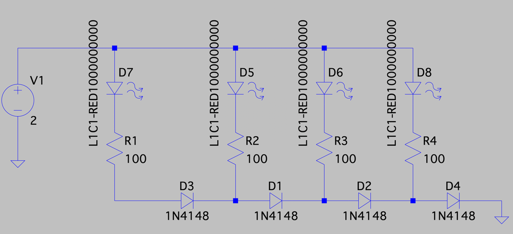
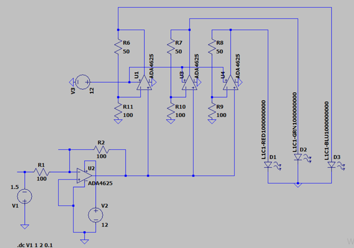
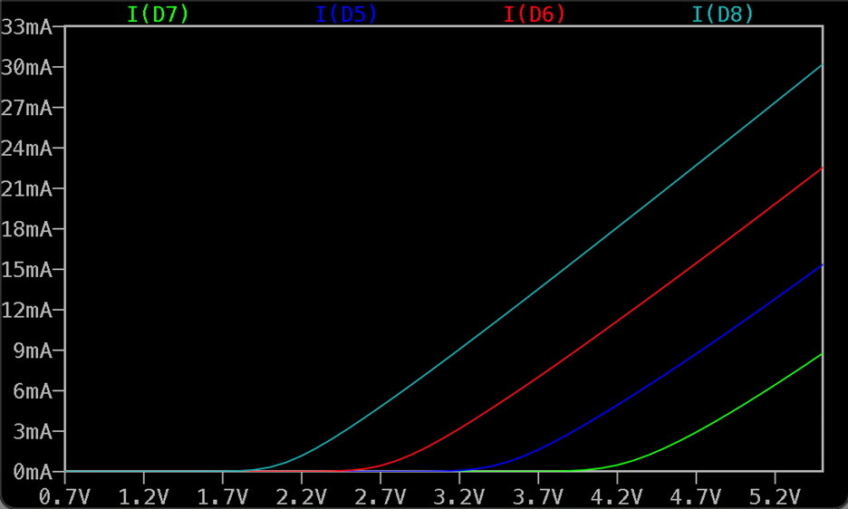
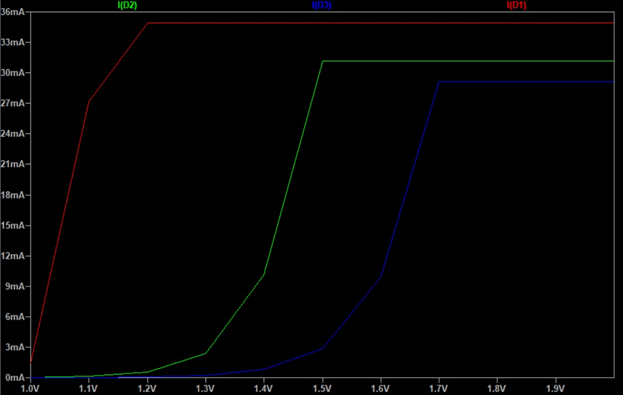

# Opto_termP_luxmeter
In this repository we public our study on luxmeter design

## Description
This project is a product of a term project for opto electronic course.

## Getting Started
We designed our circuit on a lisance free software . Ltspice is have basic and pre-advenced capacity on circuit design . 
We started on what type of component we should use such as photo diode or photo transistor . As group we decided on photo diode . 
Second which type of amplificaton comonet we shoul use . We split in to two group . Two of us designed by using transistor third member used op-amp . 
Third misson was displaying the result . Both group desided to use LED to show diffrent level of sensor output .
The design we used transistor , we display taking adventage of voltage difference by using diode and so that first group could use same colour LED . 

On the other side second group , the one use op-amp on it's design  , used voltage breking point of different colour LED . In this design you can not use same colour LED more than one . 

Finnaly we compare our similation result . Winer was second group because . It's current output was more sharper and easly limit voltage/current so can prevent LED from burn out.

Circuit 1 similation result (ampere) bellow 

Circuit 2 similation result (ampere) bellow 

You can find Ltspice similation file on ltspice_sources .

## Usage
We can use this device for measuring the of light . 

## Contributing                                                                                                                                                                     

